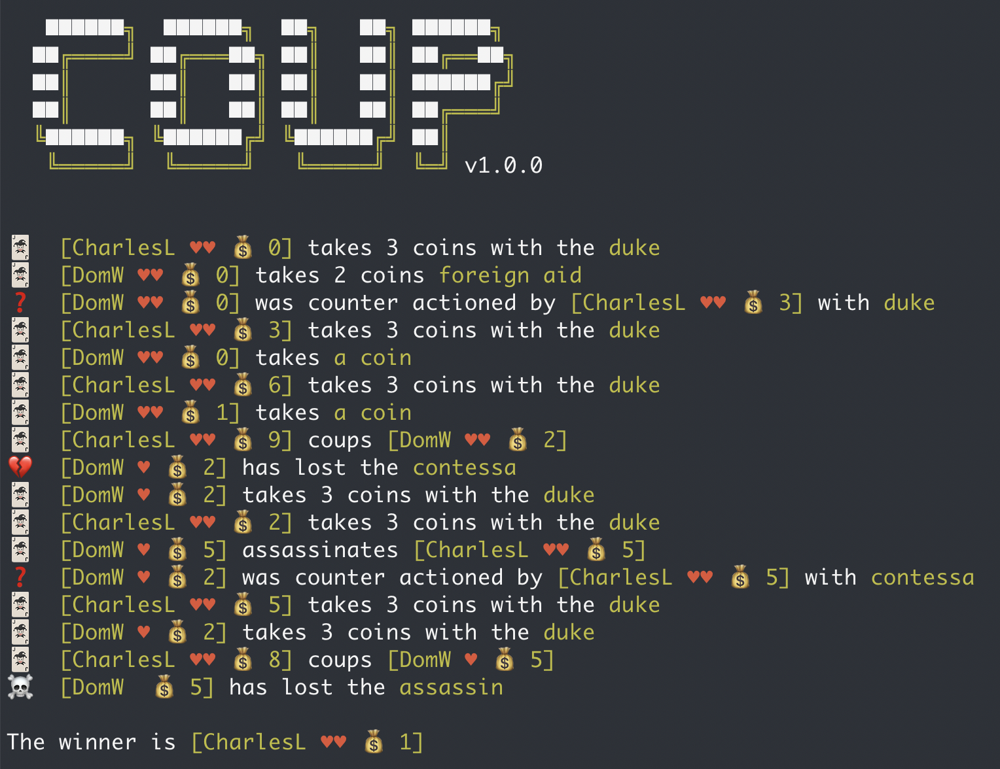
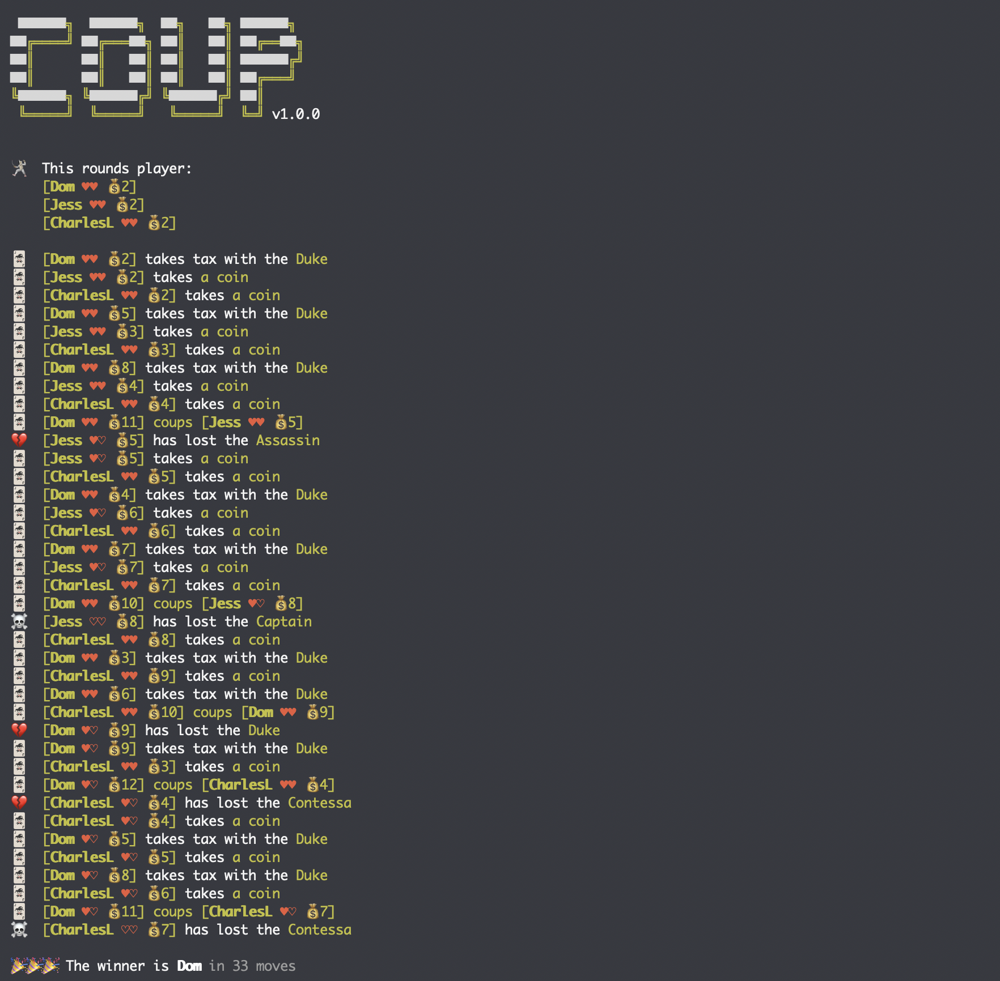
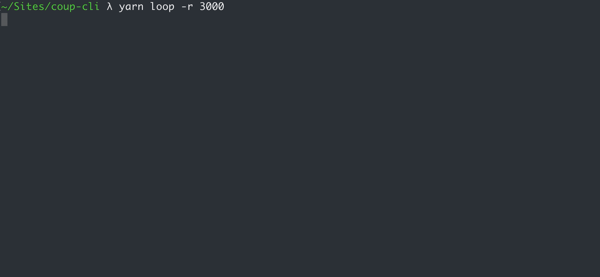

<p align="center"></p>

<p align="center">
	<a href="https://crates.io/crates/coup"></a>
	<a href="https://docs.rs/coup"></a>
	<a href="https://github.com/dominikwilkowski/coup/actions/workflows/testing.yml"></a>
</p>

# Coup

This is a coding game where, bots you build, play the popular card game
[COUP](https://en.wikipedia.org/wiki/Coup_(card_game)).

You write a bot to play COUP against other bots and tweak its behavior until you
find a winning strategy.

**_This works best if you buy the physical card game and play it a couple times maybe during your lunch break_**

The idea is to have three rounds of (1,000,000) games to find the winner (sum
all scores). Between each round you have time to make adjustments to your bot.

## How does this work?

- [Rules](#rules)
- [Scoring](#scoring)
- [How to run the game](#how-to-run-the-game)
- [How do I build a bot](#how-do-i-build-a-bot)
- [How does the engine work](#how-does-the-engine-work)
- [Changelog](#changelog)

## Rules

1. No changes to engine
1. Name of bots don't change between rounds (so you can target specific bots)
1. No data sharing between games within a round
1. No file access to other bots
1. No changing other bots
1. No internet access or calls to OpenAI
1. Do not output to `stdout` or `stderr`

## Scoring

Each game is a zero-sum-game in terms of score.
That means the amount of negative points given to losers + the amount of
positive points given to winners equals to zero.

The score is determined by the number of players (can't be more than 6 per game)
and winners (there are instances where the game can stall in a stale-mate which
the engine will stop and nominate multiple winners for).
Each game will take a max of 6 bots that are randomly elected.
Those who win get a positive score, those who lose will get a negative score.

- Score for losers: `-1/(players-1)`
- Score for winners: `∑losers/winners`

## How to run the game

You can run the game in two modes: [`play`](#play-mode) and [`loop`](#loop-mode).

### Play mode

<p align="center">
	
</p>

The `play` mode will play a single game and nominate (a) winner(s) at the end.

```rust
use coup::{
	bots::{HonestBot, RandomBot, StaticBot},
	Coup,
};

fn main() {
	let mut coup_game = Coup::new(vec![
		Box::new(StaticBot),
		Box::new(StaticBot),
		Box::new(HonestBot),
		Box::new(HonestBot),
		Box::new(RandomBot),
		Box::new(RandomBot),
	]);

	coup_game.play();
}
```

### Loop mode

<p align="center">
	
</p>

The `loop` mode will play `n` amount of games and sum all score and nominate (a)
winner(s) at the end

```rust
use coup::{
	bots::{HonestBot, RandomBot, StaticBot},
	Coup,
};

fn main() {
	let mut coup_game = Coup::new(vec![
		Box::new(StaticBot),
		Box::new(StaticBot),
		Box::new(HonestBot),
		Box::new(HonestBot),
		Box::new(RandomBot),
		Box::new(RandomBot),
	]);

	coup_game.looping(1_000_000);
}
```

## How do I build a bot

Implement the `BotInterface` and override the default implementations of each of
the methods you'd like to take control over.
The default implementation are the methods of the `StaticBot` which only takes
`Income` and is forced to coup by the engine if it accumulated more or equal to
10 coins. It does not challenge, counter or counter challenge.

The simplest way to build a bot by falling back to static behavior for each
method would be:

```rust
use coup::bot::BotInterface;

pub struct MyBot;

impl BotInterface for MyBot {
	fn get_name(&self) -> String {
		String::from("MyBot")
	}
}
```

_(This is what the `StaticBot` is.)_

From there you can choose which, if not all, of the below methods you change to
make this bot your own.

### Methods of the bot

The methods of `BotInterface` that will define the behavior of your bot.

- `get_name` – Called only once at the instantiation of the Coup game to identify your bot
- `on_turn` – Called when it's your turn to decide what to do
- `on_auto_coup` – Called when you have equal to or more than 10 coins and must coup.
- `on_challenge_action_round` – Called when another bot played an action and everyone gets to decide whether they want to challenge that action.
- `on_counter` – Called when someone played something that can be countered with a card you may have.
- `on_challenge_counter_round` – Called when a bot played a counter. Now everyone gets to decided whether they want to challenge that counter card.
- `on_swapping_cards` – Called when you played your ambassador and now need to decide which cards you want to keep.
- `on_card_loss` – Called when you lost a card and now must decide which one you want to lose

### The context

Each function gets `context` passed in which will contain below infos:

| key            | description                                                                                                                                                                                     |
| -------------- | ----------------------------------------------------------------------------------------------------------------------------------------------------------------------------------------------- |
| `name`         | Your bots name after it was de-duped by the engine. This means if you have multiple bots with the same name they get a space and a number appended to their name which is used as an identifier |
| `cards`        | Your cards/influences you still have                                                                                                                                                            |
| `coins`        | Your coins                                                                                                                                                                                      |
| `playing_bots` | A list of all playing bots this round                                                                                                                                                           |
| `discard_pile` | A list of all discarded cards so far in the game                                                                                                                                                |
| `history`      | A list of each event that has happened in this game so far                                                                                                                                      |
| `score`        | The current score of the game                                                                                                                                                                   |

## How does the engine work

The engine enforces all the rules laid out by the game as best as it can.
In areas where the rules are fuzzy or impossible to enforce in a computer world
it does best effort to come close to the real world game.

### The algorithm

```
match action
	Assassination | Stealing
		=>
			- challenge round
			- counter from target
			- counter challenge
			- action
	Coup | Income
		=>
			- action
	ForeignAid
		=>
			- counter round from everyone
			- counter challenge round
			- action
	Swapping | Tax
		=>
			- challenge round
			- action
```

### Challenges

There are two different kind of challenges we distinguish for bots:
- A challenge to an action
- A challenge to a counter action

Because the rules of the game state challenges can be called by anyone (the
order is never articulated) and because the engine can't call all bots at the
same time, the engine will go one by one from the bot whos action just triggered
the challenge.

So If player A plays an action then the first bot asked if they want to
challenge this is player B. If player C does the action the first bot will be
player D.

Perhaps best visible in [the test](https://github.com/dominikwilkowski/coup/blob/3c9fc9c1203eb8993998dc12afed323a92bcb94f/src/lib.rs#L2294-L2326).

### Targeting other bots

Because some actions require you to tell the engine who you'd like to inflict
this action upon, the engine expects you to give it a name. This name is derived
from each bots `get_name` method. The engine makes sure that there are never
multiple bots with the same name by adding a space and a number at the end of
duplicate names at the instantiation of the game.

So if we have this list of bots:
- Tici
- Bob
- Clara
- Bob

The engine will change the names to:
- Tici
- Bob
- Clara
- Bob 2

These names are then communicated to you via the [context](#the-context) struct.

### Auto couping

The rules state that if a player has 10 or more coins they have to coup the next
time it's their turn. The engine enforces this by calling the `on_auto_coup`
method instead of the `on_turn` method when it's the bots turn.

### Penalties

The engine will check what a bots plays is legal.
If a bot plays an action it can't due to insufficient funds (`couping` or
`assassination`) it will penalize this bot by taking a card from that bot (and
ask the bot which one by calling the `on_card_loss` method).

The same happened if a bot returns an action with an invalid target (a name of a
bot that does not exist).

## Changelog

### `v1.1.0`
Challenges and counter challenges are not more fair by making sure the first bot
being asked for a challenge is the bot next in line according to the bots
position. This way for every challenge-able action our counter action the first
bot is different and not, as before, the first bot in this game.

### `v1.0.0`
Initial release of new rust engine
